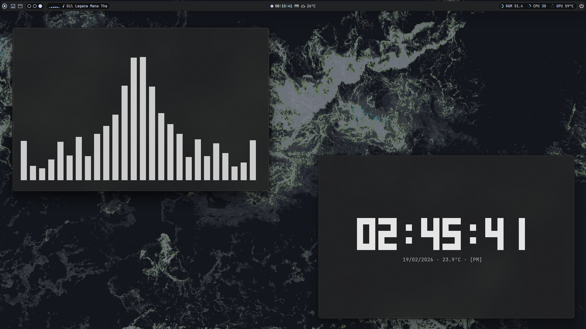
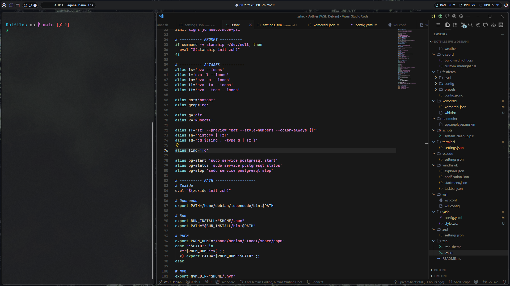
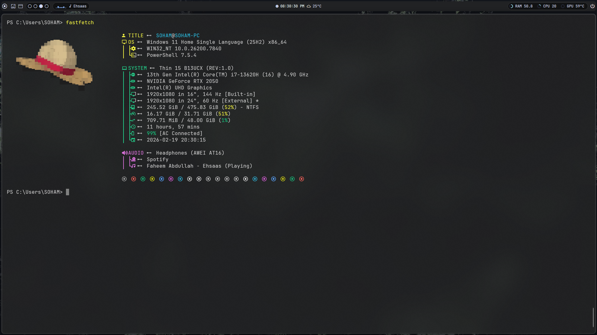
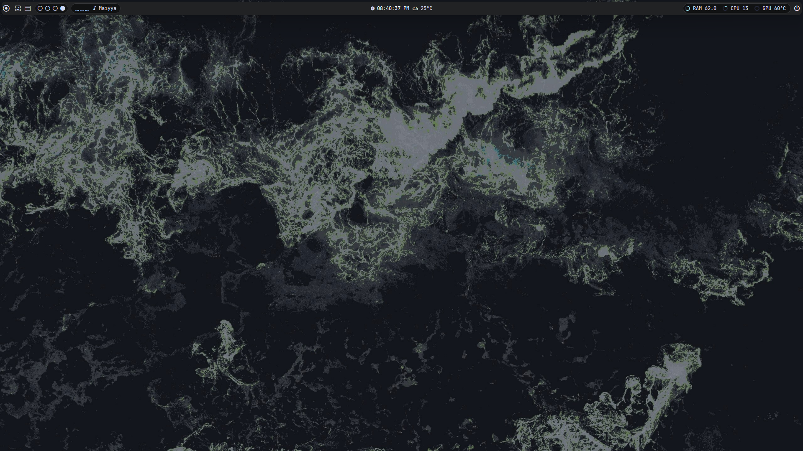

<h1 align="center">dotfiles</h1>

<p align="center">
  Personal Windows + WSL (Debian) setup.<br>
  Minimal look, fast workflow, practical tweaks.
</p>

<p align="center">
  
  
  
  
</p>

## Screenshots






## Components

| Area | Config |
|---|---|
| Bar | [YASB](#yasb) |
| WM | [Komorebi + WHKD](#komorebi--whkd) |
| Taskbar | [Windhawk](#windhawk) |
| Terminal | [Windows Terminal + Fastfetch](#windows-terminal--fastfetch) |
| Editors | [VS Code](#vscode), [Zed](#zed) |
| Shell | [Zsh](#zsh), [Bash scripts](#bash-scripts) |
| Linux monitor | [Conky](#conky) |
| WSL | [WSL Debian config](#wsl-debian-config) |
| Themes | [Discord](#discord-theme), [Rainmeter](#rainmeter) |
| Script | [PowerShell cleanup](#powershell-script) |

## Style Stack

- Custom Theme TT
- [JetBrains Mono Nerd Font](#jetbrains-mono-nerd-font)

## YASB

> Machine-specific values exist. Add your weather API key and wallpaper paths.

- Install [YASB](https://github.com/amnweb/yasb)
- Copy `yasb/config.yaml` and `yasb/styles.css`
- Restart YASB

## Komorebi + WHKD

- Install [Komorebi](https://github.com/LGUG2Z/komorebi)
- Copy `komorebi/komorebi.json` and `komorebi/whkdrc`
- Restart Komorebi

## Windhawk

> Some taskbar mods can hide Start/network elements depending on your settings.

- Install [Windhawk](https://windhawk.net/)
- Import `windhawk/taskbar.json`, `windhawk/startmenu.json`, `windhawk/explorer.json`, `windhawk/notification.json`
- Save and reload mods

## Windows Terminal + Fastfetch

> Update the ASCII path in `fastfetch/config.jsonc` for your username/path.

- Install [Windows Terminal](https://github.com/microsoft/terminal)
- Install [Fastfetch](https://github.com/fastfetch-cli/fastfetch)
- Copy `terminal/settings.json`
- Copy the `fastfetch/` folder to your config directory

```bash
fastfetch --config ~/.config/fastfetch/config.jsonc
```

## VSCode

> Base settings only. Final look depends on your extensions.

- Install [VS Code](https://code.visualstudio.com/)
- Copy `vscode/settings.json`

Theme:

- [Cursor Theme for VS Code](https://github.com/udit-001/cursor-theme-vscode)

## Zed

- Install [Zed](https://zed.dev/)
- Copy `zed/settings.json`

## Zsh

> Expects tools/plugins like `zinit`, `fzf`, `starship`, `eza`, `fd`, `ripgrep`, and `zoxide`.

- Copy `zsh/.zshrc` and `zsh/.zsh-theme`
- Install dependencies and restart shell

## Bash scripts

- `bash/cleaner.sh`
- `bash/sort.sh`
- `bash/updater.sh`

```bash
chmod +x bash/*.sh
./bash/cleaner.sh
```

## Conky

- Files: `conky/time`, `conky/weather`, `conky/services`
- Install [Conky](https://github.com/brndnmtthws/conky)
- Copy files into your Conky config location

## WSL Debian config

- `wsl/wsl.conf` (inside distro)
- `wsl/wsl.config` (Windows user profile)

```powershell
wsl --shutdown
```

## Discord theme

- `discord/build-midnight.css`
- `discord/custom-midnight.css`

## Rainmeter

- File: `rainmeter/squareplayer.rmskin`
- Install [Rainmeter](https://www.rainmeter.net/) and import the skin

## PowerShell script

- File: `scripts/system-cleanup.ps1`

## JetBrains Mono Nerd Font

<https://www.jetbrains.com/lp/mono/>
